<!-- Limit image width and height -->
<style type="text/css">
img {     
  max-height: 480px;     
  max-width: 600px; 
}
</style>

<style> .title-slide {
  background-color: #FFFFFF; /*#CBE7A5 #EDE0CF; ; #CA9F9D*/
}

.title-slide hgroup > h1{
 font-family: 'Oswald', 'Helvetica', sanserif; 
}

.title-slide hgroup > h1, 
.title-slide hgroup > h2 {
  color: #535E43 ;  /* ; #EF5150*/
}
</style>

<!-- Center image on slide -->
<script type="text/javascript" src="http://ajax.aspnetcdn.com/ajax/jQuery/jquery-1.7.min.js"></script>
<script type="text/javascript">
$(function() {     
  $("p:has(img)").addClass('centered'); 
});
</script>

<!-- Italic -->
<style>
em {
  font-style: italic
}

<!-- Bold -->

strong {
  font-weight: bold;
}

<!-- Superscript -->
sup {
  top: -0.5em;
  vertical-align: baseline;
  font-size: 75%;
  line-height: 0;
  position: relative;
}

</style>

<style>
.title-slide {
background-image:url(http://www.newsmax.com/Newsmax/files/5d/5dd1058d-4cde-4665-a136-69da850af0ac.jpg);
background-repeat: no-repeat;
background-position: 80% 8%;
background-size: 50%;
background-color: #CBE7A5; /* ; ; */
}
</style>

```{r setup, echo=FALSE, cache = FALSE}
library(knitr)
library(plyr)
library(ggplot2)
library(ggthemes)
library(boot)
```

<footer class="source">Esilehe pilt: newsmax.com
</footer>


--- .segue .dark .nobackground
## Recap

---
## p53 on muteerunud kuni pooltes kasvajates


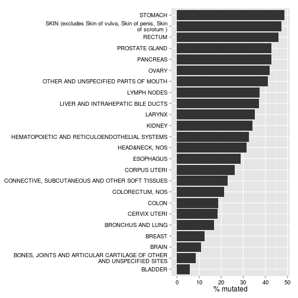

<footer class="source">Andmed: 
IARC TP53 Database R17, November 2013. Petitjean A, Mathe E, Kato S, Ishioka C, Tavtigian SV, Hainaut P, Olivier M. Impact of mutant p53 functional properties on TP53 mutation patterns and tumor phenotype: lessons from recent developments in the IARC TP53 database.Hum Mutat. 2007 Jun;28(6):622-9.
</footer>

---&twocol
## p53 kontrollib rakkude jagunemist ja apoptoosi

***=left
- Vastusena DNA kahjustustele või onkogeensele stressile p53 stabiliseeritakse ja indutseerub p53 märklaudgeenide ekspressioon, 
- mille seas on rakutsükli inhibiitorid (**p21cip1**) ja proapoptootilised valgud (**BAX** BH3 only), 
- surmaretseptor FAS, mis muudab rakud tundlikuks Fas ligandile FasL, 
- sekreteeritav IGFBP-3, mis seob IGF-1 ja -2 surudes alla ellujäämist soodustavat signalisatsiooni.

***=right


<footer class="source">Pilt: 
<a href="http://www.nature.com/nrc/journal/v6/n1/fig_tab/nrc1780_F4.html">
p21 and DNA damage signalling.
</a>
</footer>

--- .segue .dark .nobackground
## Senesents ja immortalisatsioon

---
## Rakkude jagunemispotensiaal koekultuuris on piiratud 


<footer class="source">Pilt: Hayflick limit. Phase I is the primary culture; phase II represents subcultivated cells during the period of exponential replication. Phase III represents the period when cell replication ceases but metabolism continues. Cells may remain in this state for at least one year before death occurs.

</footer>

---


- Inimese või närilise embrüo fibroblastidel on koekultuuris ainult piiratud jagunemisvõime  
- Rakud lõpetavad jagunemise kusagil peale 60 jagunemist
- Sellised mittejagunevad rakud on saavutanud replikatiivse vananemise seisundi (*repilcative senescence*/*senescence*)
- Senesentsed rakud jäävad metaboolselt aktiivseks kuid nõivad olevat kaotanud jäädavalt võime siseneda aktiivselt rakutsükklisse.
- Kasvufaktorite olemasolul võivad sellised sellised senesentsed rakud püsida koekultuuris elus pikalt.


<footer class="source">Pilt: http://www.manchester.ac.uk/discover/news/new-method-to-detect-ageing-cells--and-aid-rejuvenation-therapies---developed-by-researchers
</footer>

---
## Rakkude jagunemispotentsiaal langeb vanusega

Vananedes rakkude jagunemispotentsiaal väheneb. Naha keratinotsüütide puhul väljendub see keratinotsüütide kihi õhenemises ja selle koe lainelise arhitektuuri kadumises.


---
## Vähirakkude jagunemine ja tuumori suurus

Lähtudes eksponentsiaalse kasvu kineetikast, eraldab algset vähirakku lõpp-staadiumi kasvajast umbes 40 rakugeneratsiooni


---

- Reaalsuses on vähirakkude jagunemine suures osas mitteproduktiivne ja igas generatsioonis läheb suur osa rakke apoptoosi.
- Seega on vaja suure kasvaja tekkeks oluliselt rohkem jagunemisi kui maksimaalsed 50-60.
- 50 kuni 60 jagunemisega saaks eksponentsiaalse kasvu korral vähimassi, milles oleks $10^{18}$ rakku $\cong$ $10^9$ $cm^3$ $\cong$ $10^6$ kg.


---
## Rakkude senesentsi võib põhjustada erinevat tüüpi stress  


---&twocol
## Koekultuuri stress indutseerib senesentsi

***=left

Oksütatiivse stressi tingimustes (20% $O_2$) kasvatatud rakud läbivad vähem pooldumisi.

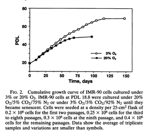

***=right

Normaalsed epiteelirakud sõltuvad stroomarakkude toetusest. Kui inimese eesnaha keratinotsüüte kasvatada puhta kultuurina ilma feederrakkudeta indutseerub neis kiirelt rakutsükli blokk läbi p16ink4a ekspressiooni.

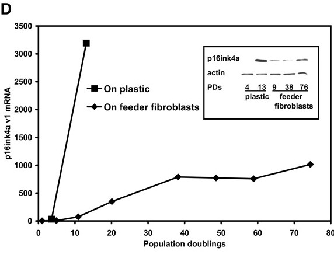

<footer class="source">Pildid: 
<a href="http://www.ncbi.nlm.nih.gov/pmc/articles/PMC41939/?page=1">
Chen et al., 1995
</a>, 
<a href="http://cancerres.aacrjournals.org/content/63/22/7815.long">
Fu et al., 2003
</a>.
</footer> 


---
## Onkogeenne Ras vajab transformeerimiseks lisajõude

- Onkogeenselt aktiveeritud Ras valgud on võimelised transformeerima immortaliseeritud hiire rakke  ([Der et al., 1982](http://dx.doi.org/10.1073/pnas.79.11.3637); [Parada et al., 1982](http://www.nature.com/doifinder/10.1038/297474a0)). 
- Kuid hiire embrüonaalsete fibroblastide transfekteerimine inimese ras onkogeeniga ei muuda neid tumorigeenseteks enne kui need rakud on koekultuuri adapteeritud ja immortaliseerunud.
- Selline **immortaliseerumine saavutatakse** ka siis kui viia rakku koos ras-iga sisse ka mõni teine lisa onkogeen, näiteks v-myc või c-myc, või SV40 suur-T antigeen.
- Normaalsetel inimese rakkudel on koekultuuris piiratud eluiga (näiteks HUVEC rakke kasutatakse kuni 8 passeerimiseni) ja neil ei teki spontaanset immortaliseerumist (erinevalt hiire-roti rakkudest).

---&twocol 
## p53 blokeerib Ras transformatsiooni

***=left

- Normaalsete inimese või hiire ja roti fibroblastide transformeerimisel H-RasV12-ga blokeerub nende rakkude jagunemine palju varem kui nad saavutavad konfluentsuse. 
- See jagunemise blokk on pöördumatu (**senesents**) ja sellega kaasneb p53 ja p21Cip1 ning p16INK4a valkude akumulatsioon.
- Rakkude minemist senesentsi on võimalik vältida kui p53 neutraliseerida, näiteks adenoviiruse E1A valgu transfekteerimisel.

***=right

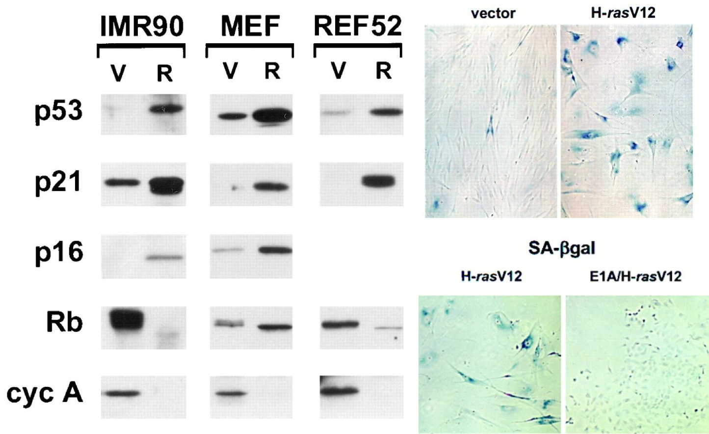

<footer class="source">Pilt: 
<a href="http://www.sciencedirect.com/science/article/pii/S0092867400819029#">
Serrano, 1997
</a>
</footer>

---
## Onkogeen indutseeritud senesents

- **OI senesents on tuumorsuppressor mehhanism** mis toimib healoomulised kasvajates ([onkogeensete radade aktivatsioon normaalsetes rakkudes põhjustas kiire jagunemise bloki](#7)).
- Pahaloomulistes kasvajates on OI mehhanismid juba tasalülitatud (mutatsioonid p53-s ja RB-s, telomeraas).
- Mutatsioonid K-ras, B-raf, PTEN ja NF1 geenis käivitavad rakkudel senesentsi ka *in vivo*.
- *In vivo* andmed toetavad hüpoteesi, et senesents toimib tuumor-suppressor mehhanismina.
- Onkogeenide põhjustatud senesents on aktiivne protsess ning pole põhjustatud replikatiivse potentsiaali kadumisest (telomeerid on neis rakkudes ok!).

---
# Premalignant lung adenomas induced by oncogenic K-ras are positive for markers of senescence, whereas malignant adenocarcinomas are negative.


<footer class="source">Pilt: 
<a href="http://www.nature.com/nature/journal/v436/n7051/fig_tab/436642a_F1.html">
Collado et al., 2004
</a>.
</footer>

---&twocol
## OIS on põhjustatud DNA kahjustustest

***=left

- Onkogeenide poolt indutseeritud stress on põhjustatud ka DNA kahjustuste poolt mis on tekkinud kas
    - hapnikuradikaalidest (ROS) ([Lee et al., 1999](http://www.nature.com/onc/journal/v27/n20/full/1210950a.html#bib29))või
    - ülemäärasest replikatsioonist ([Bartkova et al., 2006](http://www.nature.com/onc/journal/v27/n20/full/1210950a.html#bib2)).
- Senesentsi pöördumatuse tingivad ulatuslikud kromatiinimodifikatsioonid (metülatsioon) mis väljenduvad heterokromatiinsete fookuste (*senescence-associated heterochromatic foci*) näol.

***=right


# HP1-beta ja PML valkude akumuleerumine kromatiinile initseerib DNA kahjustuste parandamise mehhanismid

<footer class="source">
Pilt: the-scientist.com
</footer>

---
## *In vivo* ja *in vitro* senesentsi markerid

Marker | Test
-------|-------
SA-$\beta$-Gal	| histokeemia	
p16INK4a | WB, IHC
p15INK4b | WB, IHC
p53	| WB, IHC
ARF	| WB, IHC
p21	| WB, IHC
SAHFs	| IF
DEC1 | WB, IHC
DCR2 | WB, IHC

<p style="font-size:12pt">WB, western blot. IHC, immunohistochemistry. IF, immunofluorescence. SAHFs, senescence-associated heterochromatic foci. DEC1, differentiated embryo-chondrocyte expressed. DCR2, decoy death receptor 2.</p>

--- &twocol
## BRAF mutatsioonid lükkavad sünnimärgi melanotsüüdid senesentsi

***=left


***=right

- Sünnimärgid (*naevi*) sisaldavad sageli onkogeenseid BRAF V600E mutatsioone.
- Sellised sünnimärgid jäävad siiski kümneteks aastateks vaikeolekusse ja ainult harva arenevad melanoomiks.
- Pidev BRAFV600E ekspressioon inimese melanotsüütides indutseerib rakutsükli bloki, mida iseloomustab p16INK4a ja happelise $\beta$-galaktosidaasi ekspressioon (SA-$\beta$-Gal).

<footer class="source">Pilt: 
<a href="http://www.nature.com/nature/journal/v436/n7051/full/nature03890.html">
BRAFE600-associated senescence-like cell cycle arrest of human naevi.
</a>
</footer>

---
Geenid mis indutseerivad senesentsi

Geen | Muutus vähis |  Kontekst | Rakutüüp  | Vähk/kude  |	Viited
-----|------------------------------------|----------------------------------------|---------------------------------------------|----------------------------------------------|-----
Onkogeenid | | |  | |
Ras |	*GOF* mutatsioon	| mutantse alleeli ekspressioon	| HDF ja MEF*	| kopsu adenoomid; aterosklerootilised kahjustused; rinnanäärme hüperplaasia	| [Serrano et al., 1997](http://www.sciencedirect.com/science/article/pii/S0092867400819029#), [Collado et al., 2005](http://www.nature.com/doifinder/10.1038/436642a), [Minamino et al., 2003](http://dx.doi.org/10.1161/01.CIR.0000093274.82929.22), [Sarkisian et al., 2007](http://www.nature.com/doifinder/10.1038/ncb1567)
Raf	| *GOF* mutatsioon	| mutantse alleeli ekspressioon	| HDF, MEF*, melanotsüüdid | kopsu adenoomid |	[Dankort et al., 2007](http://genesdev.cshlp.org/content/21/4/379.full), [Michaloglou et al., 2005](http://www.nature.com/nature/journal/v436/n7051/full/nature03890.html)
Akt	| *GOF* mutatsioon	| müristüleeritud alleeli üleekspressioon | endoteelirakud ja MEF | |	[Chen et al., 2005](http://www.nature.com/nature/journal/v436/n7051/full/nature03918.html), [Miyauchi et al., 2004](http://emboj.embopress.org/content/23/1/212.long)
E2F1/3	| amplifikatsioon	| üleekspressioon	| HDF	| ajuripatsi hüperplaasia	| [Dimri et al., 2000](http://mcb.asm.org/content/20/1/273.long), [Lazzerini Denchi et al., 2005](http://mcb.asm.org/content/25/7/2660.full)
Cyclin E | amplifikatsioon  | üleekspressioon	| U20S	| |	[Bartkova et al., 2006](http://www.nature.com/nature/journal/v444/n7119/full/nature05268.html)
mos	| translokatsioon/üleekspressioon  | üleekspressioon	| HDF	| |	[Bartkova et al., 2006](http://www.nature.com/nature/journal/v444/n7119/full/nature05268.html)
cdc6 | üleekspressioon | üleekspressioon | HDF | | [Bartkova et al., 2006](http://www.nature.com/nature/journal/v444/n7119/full/nature05268.html)
Tumor suppressors | | | | |
PTEN | *LOF* mutatsioon	| inaktivatsioon | MEF and IMR90 | HG-PIN	| [Chen et al., 2005](http://www.nature.com/nature/journal/v436/n7051/full/nature03918.html), [Courtois-Cox et al., 2006](http://www.sciencedirect.com/science/article/pii/S1535610806002893)
NF1 | *LOF* mutatsioon | inaktivatsioon |	HDF |	dermaalne healoomuline fibroom | [Courtois-Cox et al., 2006](http://www.sciencedirect.com/science/article/pii/S1535610806002893)

<p style="font-size:10pt">Lühendid: GOF, gain of function; HDF, human diploid fibroblast (IMR90 ja BJ); LOF, loss of function; MEF, murine embryonic fibroblast; HG-PIN, high-grade prostatic intrapithelial neoplasia. MEF*: senesetsi indutseerimiseks on vajalik üleekspressioon. Tabel: <a href="http://www.nature.com/onc/journal/v27/n20/full/1210950a.html">Courtois-Cox, 2008</a></p>


---
## Telomeerid

- Telomeerid on DNA-valk kompleksid, mis stabiliseerivad lineaarsed kromosoomide otsad. 
- Imetajate telomeerid koosnevad 5-15 kb pikkustest **TTAGGG** kordusjärjestustest, mis lõppevad 3' üheahelalise *overhang*-iga.
- Telomeeride pikkuse säilitamise eest vastutab **telomeeraas** või *alternative telomere length* (ALT) korrastus-mehhanism, mis põhineb rekombinatsioonil (>10% vähirakkudel).

--- &twocol
## Kromosoomid millel puuduvad õiged otsad on ebastabiilsed

***=left

 
- 1930.ndatel täheldasid Hermann Müller ja Barbara McClintock erinevust katkenud kromosoomide käitumise ja telomeeride vahel.
- Hermann Müller leidis, et kromosoomid millel puuduvad 'õiged' otsad on ebastabiilsed.
- McClintock leidis, et katkenud otsad fuseeruvad kuid mitte kromosoomid. 


***=right


<footer class="source">Pilt: Smithsonian Institution
</footer> 

---
## Telomeeride tähtsus - fusion-bridge-breakage

- Telomeerid võimaldavad rakkudel eristada kromosoomi otsad katkenud DNAst.
- DNA kahjustuse korral võib parandamine toimuda kahel viisil:
    - homoloogne rekombinatsioon (HR).
    - mittehomoloogne otste ühendamine (*non-homologous end-joining*, NHEJ).
- Telomeerid hoiavad ära NHEJ põhjustatud kromosoomide fusiooni.
- NHEJ põhjustatud *Fusion-bridge-breakage* tsüklid viivad genoomse ebastabiilsuse tekkeni.
- Telomeerid annavad rakule autonoomse mehhanismi jagunemistsüklite lugemiseks.

---

<iframe width="640" height="390" src="http://www.youtube.com/embed/VuzeD_VyBO4" frameborder="0" allowfullscreen></iframe>

---&twocol
## Telomeeride pikkus määrab rakkude replikatiivse potentsiaali

***=left

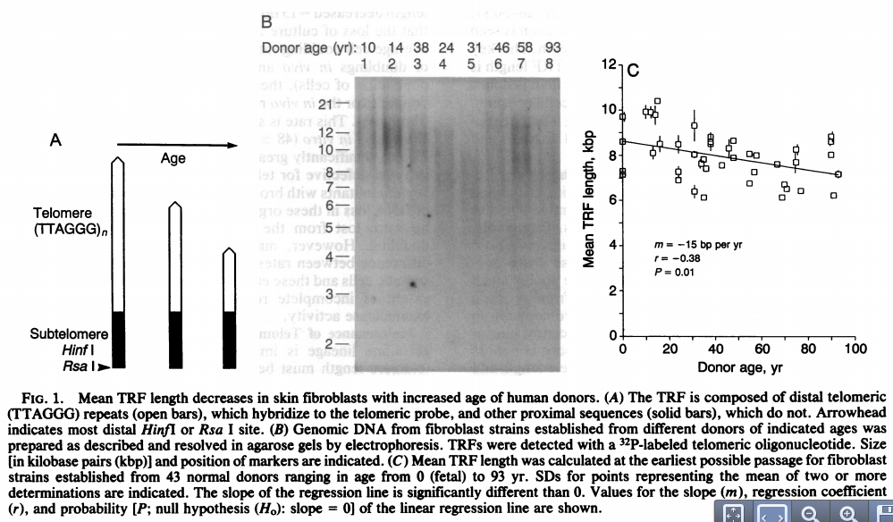

***=right

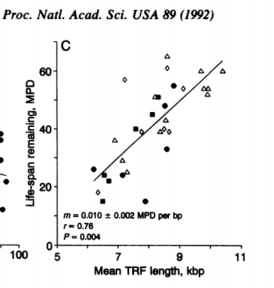

<footer class="source">Pildid: 
<a href="http://www.pnas.org/content/89/21/10114.full.pdf">
Allsopp et al., 1992.
</a>
</footer> 

--- &twocol
# Telomeeride lühenemine lõppeb kriisiga ja võib põhjustada immortalisatsiooni

- SV40 large-T transformeeritud inimese neeru fibroblastid (HEK) jagunevad kuni telomeeride lühenemiseni ~1.5 kb pikkusteks.
- Lühenenud telomeerid põhjustavad rakkudes nö. kriisi, millest vähesed ellujäävad kloonid väljuvad immortaliseerununa.
- Immortaliseerunud rakud ekspresseerivad telomeraasi.

***=left


***=right

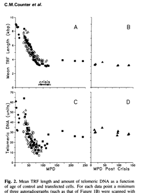

<footer class="source">Pildid: 
<a href="http://www.ncbi.nlm.nih.gov/pmc/articles/PMC556651/?page=1">
Counter et al., 1992.
</a>
</footer> 

---
## Telomeeride lühenemine ehk "*end replication problem*"

Telomeerid lühenevad iga raku jagunemisega S-faasis
- DNA otste replikatsiooni probleem "*end replication problem*":
    - DNA replikatsioon on bidirektsionaalne.
    - DNA polümeraasid toimivad ühesuunaliselt.
- DNA polümeraasid vajavad replikatsiooni alustamiseks praimerit.
- DNA replikatsiooniga jääb kromosoomi otstest 50-200 bp DNA lõik 3' otsast replitseerumata (3' *overhang*).
- Rakud mille telomeerid on 10-12 kb pikad jagunevad 50-60 korda.
- Rakud lähevad senesentsi kui telomeerid "kuluvad" 4-6 kb pikkusteks.

---
## Telomeeride erosioon toimib tuumor-suppressor mehhanismina

- Inimese rakkude immortaliseerumisel toimub alati ka telomeeride korrashoiu mehhanismi käivitamine kas **telomeraasi** üle-ekspressiooni või **ALT mehhanismi** käivitamise teel.
- 60-80% inimese vähkidest on telomeraas positiivsed, viidates et telomeeride erosiooni vältimine on vähis sama tavaline kui Rb ja p53 inaktivatsioon.
- Tüvirakkudes on telomeraasi aktiivsus madalam kui vähirakkudes ja paljudes normaalsetes jagunevates rakkudes puudub telomeraasi ekspressioon täielikult.
- Siit võib järeldada, et **telomeeride regeneratsioon on vähis hädavajalik vähirakkude jagunemispotentsiaali säilitamiseks**.

--- &twocol
## Inhibition of telomerase limits the growth of human cancer cells

***=left


***=right

Effects of DN-hTERT on cell proliferation.
Clonal isolates analyzed are from cell lines LoVo a, HA-1 b, SW613 c, 36M d and GM847 cells e; in order of initial telomere length from shortest (LoVo) to longest (GM847). For each cell line, two clones are shown expressing the control retrovirus ($\square$, $\blacksquare$), WT-hTERT ($\circ$, $\bullet$) or DN-hTERT ($\triangle$, $\blacktriangle$).

<footer class="source">Ref.: 
<a href="http://www.nature.com/nm/journal/v5/n10/full/nm1099_1164.html">
Hahn et al., 1999.
</a>
</footer> 

---&twocol
# Telomeraas ja ALT

Telomeraasi holoensüüm koosneb kahest konserveerunud komponendist: 
- **Telomeraas** (**TERT**), mis sisaldab telomeraasi pöördtranskriptaasi domääni ja 
- **RNA** **TR** (**TERC**), mis moodustab TERT-iga kompleksi ja **toimib praimerina** telomeersete korduste sünteesil.
- Lisaks on kompleksis ka **dyskerin**, mis stabiliseerib telomeraasi holoensüümi.
- Mutatsioonid TERT, TR või DKC1 geenides põhjustavad inimesel telomeerseid sündroome.

***=right


<footer class="source">Pilt: 
<a href="http://www.nature.com/nrg/journal/v13/n10/full/nrg3246.html">
Armanios & Blackburn, 2012.
</a>
</footer> 

---&twocol
## Telomeeride regeneerimise ALT mehhanism

***=left

- **Homoloogne rekombinantsioon** kus uus telomeerne DNA sünteesitakse rekombinatsiooni ajal kõrval oleva kromosoomi pealt.
- **Õdekromatiidide telomeeride ebavõrdne vahetus** (*unequal telomere sister chromatid exchanges (T-SCEs)*). Tingituna telemoeersetest kordusjärjestustest saab üks õdekromatiid rekombinatsioonis teiselt kromatiidilt rohkem materjali kui 'vastu annab'. Tekkinud tütarrakkudest ühes on telomeerid pikenenud, teises lühenenud.

***=right


<footer class="source">Pilt: 
<a href="http://www.nature.com/nrg/journal/v11/n5/full/nrg2763.html">
Cesare & Reddel, 2010.
</a>
</footer> 

--- &twocol
## Telomeraasi üle-ekpressioon vähis

***=left
```{r telomeraas, echo=FALSE, fig.show='asis'}
shay<-list(data.frame(Tissue=rep("Head, neck and lung",7),
                      Pathology=c("Normal oral mucosa",
                                  "Oral rinses from HNSCC",
                                  "Premalignant lesions",
                                  "HNSCC",
                                  "NSCLC",
                                  "SCLC",
                                  "Lung, adjacent tissue"),
                      pos=c(1,14,25,112,98,15,3),
                      tested=c(39,44,46,130,125,15,68)),
           data.frame(Tissue=rep("GI tract",11),
                      Pathology=c("Gastric metaplasia, adenoma",
                                  "Gastric carcinoma",
                                  "Gastric, adjacent tissue",
                                  "Colorectal adenoma",
                                  "Colorectal carcinoma",
                                  "Colorectal, adjacent and normal tissue",
                                  "Benign pancreatic lesion",
                                  "Pancreatic carcinoma",
                                  "Pancreatic, adjacent tissue",
                                  "Pancreatic brushings, bening",
                                  "Pancreatic brushings, carcinoma"),
                      pos=c(4,72,4,20,123,58,0,41,5,0,8),
                      tested=c(15,85,86,44,138,231,11,43,36,4,8)),
           data.frame(Tissue=rep("Hepatic tissue",4),
                      Pathology=c("Normal tissue",
                                  "Non-malignant liver disease",
                                  "Hepatocellular carcinoma",
                                  "Hepatic, adjacent tissue"),
                      pos=c(0,43,149,1),
                      tested=c(15,148,173,50)),
           data.frame(Tissue=rep("Breast",8),
                      Pathology=c("Normal tissue",
                                  "Breast fibrocytic disease",
                                  "Breast fibroadenoma",
                                  "Breast carcinoma in situ",
                                  "Breast carcinoma (ductal and lobular)",
                                  "Adjacent tissue",
                                  "Breast fine needle aspirates, benign",
                                  "Breast fine needle aspirates, malignant"),
                      pos=c(0,0,11,9,300,4,4,26),
                      tested=c(15,34,40,12,339,85,47,32)),
           data.frame(Tissue=rep("Female reproductive tract",10),
                      Pathology=c("Ovary (fetal)",
                                  "Ovary (adult)",
                                  "Unfertilised egg",
                                  "Normal myometrium or endometrium",
                                  "Leiomyoma",
                                  "Leiomyosarcoma",
                                  "Endometrial adenocarcinoma",
                                  "Cervical carcinoma",
                                  "Vaginal carcinoma",
                                  "Ovarian carcinoma"),
                      pos=c(2,1,0,0,0,5,4,16,3,21),
                      tested=c(2,3,3,18,14,5,4,16,3,23)),
           data.frame(Tissue=rep("Male reproductive tract",7),
                      Pathology=c("Testis (fetal, adult)",
                                  "Mature spermatozoa",
                                  "Normal prostate",
                                  "Benign prostate hyperplasia",
                                  "Benign prostate hyperplasia with carcinoma",
                                  "High grade prostatic intra-epithelial neoplasia",
                                  "Prostate carcinoma"),
                      pos=c(3,0,0,1,4,3,52),
                      tested=c(3,3,43,20,35,5,58)),
           data.frame(Tissue=rep("Kidney and urinary tract",10),
                      Pathology=c("Normal urothelium",
                                  "Normal voided urine",
                                  "Dysplastic urothelium",
                                  "Bladder carcinoma (all stages)",
                                  "Bladder carcinoma (washings)",
                                  "Bladder carcinoma (voided urine)",
                                  "Renal carcinoma",
                                  "Kidney, adjacent tissue",
                                  "Wilms' tumor",
                                  "Wilms' tumor, adjacent tissue"),
                      pos=c(0,3,3,172,29,16,95,0,6,2),
                      tested=c(45,83,7,185,40,56,115,115,6,6)),
           data.frame(Tissue=rep("Neural tissue",12),
                      Pathology=c("Normal retina and brain",
                                  "Retinoblastoma",
                                  "GBM",
                                  "Oligodendroglioma",
                                  "Anaplastic astrocytoma",
                                  "Meningioma, ordinary",
                                  "Meningioma, atypical",
                                  "Meningioma, malignant",
                                  "Normal adrenal (newborn)",
                                  "Ganglioneuroma",
                                  "Neuroblastoma",
                                  "Adjacent tissue"),
                      pos=c(0,17,45,19,2,5,12,9,0,0,99,0),
                      tested=c(9,34,60,19,20,30,13,9,3,4,105,13)),
           data.frame(Tissue=rep("Skin",4),
                      Pathology=c("Normal epidermis",
                                  "Squamous cell carcinoma",
                                  "Basal cell carcinoma",
                                  "Melanoma"),
                      pos=c(4,15,73,6),
                      tested=c(9,18,77,7)),
           data.frame(Tissue=rep("Hematological tissues",14),
                      Pathology=c("Myeloma",
                                  "Lymphoma, low grade",
                                  "Lymphoma, high grade",
                                  "Lymph nodes, benign",
                                  "Tonsils, benign",
                                  "Myelodysplastic syndrome",
                                  "Chronic myeloid leukaemia, chronic",
                                  "Chronic myeloid leukaemia, early accelerated",
                                  "Chronic myeloid leukaemia, blast",
                                  "Chronic lymphoid leukaemia, early",
                                  "Chronic lymphoid leukaemia, late",
                                  "Acute promyelocytic leukaemia",
                                  "Acute lymphoblastic leukaemia",
                                  "Acute myeloid leukemia"),
                      pos=c(1,12,16,5,23,4,30,1,21,2,4,1,4,47),
                      tested=c(1,14,16,15,23,6,42,3,21,14,7,1,5,64))
)
shay <- do.call("rbind", shay)
shay$State <- "malignant"
norm <- unique(c(grep("[Nn]ormal", shay$Pathology),
       grep("adjacent", shay$Pathology),
       grep("Testis", shay$Pathology),
       grep("Ovary", shay$Pathology),
       grep("Unfertilised", shay$Pathology),
       grep("spermatozoa", shay$Pathology),
       grep("Dysplastic", shay$Pathology)))
shay$State[norm] <- "normal"
benign <- unique(c(grep("[Bb]enign", shay$Pathology),
                   grep("Non-malignant", shay$Pathology),
                   grep("fibrocytic", shay$Pathology),
                   grep("ordinary", shay$Pathology)))
shay$State[benign] <- "benign"

shay <- mutate(shay, Percent=pos*100/tested)

ggplot(shay) + 
  geom_bar(aes(y=Percent, x=Pathology, fill=State), stat="identity") + 
  ylab("% positive") +
  scale_fill_colorblind() +
  facet_wrap(~Tissue, scales="free_x") + 
  scale_x_discrete(labels=function(x) abbreviate(x, minlength=16)) +
  theme(axis.text.x=element_text(angle=90, vjust=0.5, color="black"),
        axis.text.y=element_text(color="black"),
        axis.title.x = element_blank(),
        legend.title=element_blank(),
        legend.position = c(1, 0), 
        legend.justification = c(1.5, 0.5))
```

***=right

Telomeraas positiivsed kasvajad (%, keskmine ja 95% usalduspiirid.) 
```{r keskmine, echo=FALSE, results='markup' }
out <- ddply(shay,"State", summarise, Mean=round(mean(Percent),digits=1), 
      Lower = round(boot.ci(boot(Percent, function(u,i) mean(u[i]), R = 999), type = "perc")$percent[4],digits=1),
      Upper = round(boot.ci(boot(Percent, function(u,i) mean(u[i]), R = 999), type = "perc")$percent[5],digits=1))
kable(out)
```


<footer class="source">Andmed: 
<a href="http://www4.utsouthwestern.edu/cellbio/shay-wright/publications/Bachetti.EJC.97.pdf">
Shay, J. W. & Bacchetti, S. A survey of telomerase activity in human cancer. Eur. J. Cancer 33, 787–791 (1997).
</a></footer>

---&twocol
## Telomeeride otsas on sõlm

***=left


***=right

- Telomeersele DNA-le seostub valgukompleks nimega **shelterin**.
- Inimese shelterin kompleks koosneb kuuest valgust: *telomere repeat binding factor 1* (TRF1), TRF2, *repressor/activator protein 1* (RAP1), *TRF1-interacting nuclear protein 2* (TIN2), *TIN2-interacting protein 1* (TPP1) ja *protection of telomeres 1* (POT1).
- Telomeerne DNA moodustab suure lingu **t loop**-i, mille 3' *overhang* ots paardub telomeeri kordusjärjestuste paarisahelalise osaga. 
- TRF2 indutseerib *t loop* struktuuri moodustamise *in vitro* ja ka tema *in vivo* funktsioon vastab t loop-ide .

<footer class="source">Pilt: 
<a href="http://www.sciencemag.org/content/283/5406/1321.full">
Karlseder, 1999
</a>
</footer>

---
## T-loop

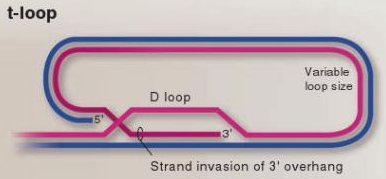

---
## TRF valgud

- TRF1 reguleerib telomeeride pikkust.
    - TRF1 on seotud negatiivse tagasisidega, seostub otse telomeeridele ja supresseerib telomeeride elongatsiooni.
    - pikaajaline TRF1 üle-ekpressioon telomeraas-positiivetes HT1080 vähirakkudes põhjustas telomeeride lühenemise.
- TRF2 vastutab selle eest, et telomeerid oleksid vinks-vonks korras.
- TRF2 inhibitsioon põhjustab 3' *overhang*-i kadumise telomeeri otsast ja viib kromosoomi otste fuseerumiseni.

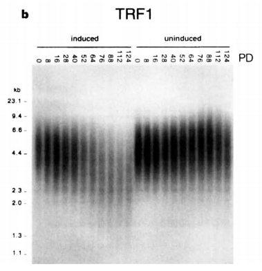

---
## TRF2 kaitseb inimese telomeere otsipidi kokku fuseerumast

Muteerunud DNA sidumise domääniga TRF2 (TRF2ΔBΔM) ekspressioon rakkudes viib otsipidi fuseerunud kromosoomide tekkeni.

Anafaasi rakud, milles on TRF2ΔBΔM-indutseeritud anafaasi sillad ja lohisev kromosoom (vasakpoolne rakk). DNA on värvitud DAPI-ga.

<footer class="source">Pilt: 
<a href="http://www.sciencedirect.com/science/article/pii/S0092867400809320">
van Steensel, 1998
</a>
</footer>


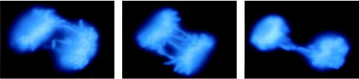

---
## Telomeeride avanemine ja lühenemine indutseerib apoptoosi

- TRF2 seostumine TTAGGG kordustele maskeerib kromosoomi otsad DNA kahjustuste kontrolli mehhanismi eest.
- TRF2 inhibitsioon põhjustab kiire ATM/p53–sõltuva DNA kahjustuse kontrollpunkti aktivatsiooni, rakutsükli arresti ja suunab rakud apoptoosi.
- Katmata kromosoomi otsad mis tekivad TRF2 funktsiooni inhibeerimisel seostuvad DNA kahjustuste kontrolli valkudega 53BP1, $\gamma$-H2AX, Rad17, ATM ja Mre11.

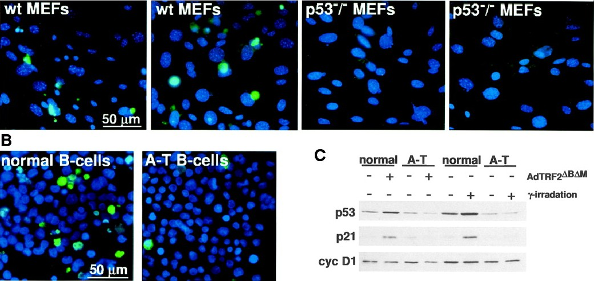

---&twocol
## Hiirte telomeerid

***=left

- Hiirtel on kolm korda pikemad telomeerid kui inimestel, samas on nende eluiga lühike.
- TR knockout-hiired ei ole resistentsed tumorigeneesile.
- mTR null hiirel lühenevad telomeerid 4–5 kb generatsiooni kohta.
- Võrreldes esimese generatsiooni loomadega oli kolmanda (G3) ja kuuenda (G6) generatsiooni hiirtel probleeme haavade paranemisega, hematopoeesiga, neil oli suurem kasvajate intsidents ja lühem eluiga.

***=right
Increased Incidence of Skin Lesions, Alopecia, and Hair Graying in Aging mTR−/− Mice


<footer class="source"> Pilt: 
<a href="http://www.sciencedirect.com/science/article/pii/S0092867400805802">Rudolph, 1999</a>
</footer>

---&twocol
# Telomere dysfunction promotes non-reciprocal translocations and epithelial cancers in mice

***=right

Kaplan–Meier analysis of tumour incidence in p53 mutant mice divided on the basis of generation of telomerase deficiency.

Telomere attrition in ageing telomerase-deficient p53 mutant mice promotes the development of epithelial cancers by a process of fusion-bridge breakage that leads to the formation of complex non-reciprocal translocations—a classical cytogenetic feature of human carcinomas.

***=left


<footer class="source"> Pilt: 
<a href="http://www.nature.com/nature/journal/v406/n6796/full/406641a0.html">
Artandi et al., 2000.
</a>
</footer>

---&twocol
## Põletiku ja vähi seos: lühenenud telomeerid

Põletikuline soolehaigus (*ulcerative colitis*) on seotud kõrge kolorektaalvähi riskiga ja seda tingituna genoomsest edastabiilsusest.
- Telomeeride pikkus korreleerub kromosomaalse ebastabiilsusega selles vähieelses seisundis.
- Soolehaigete patsientide käärsoole epiteelis kellel on vähikolded juba välja arenenud esinevad anafaasi sillad (BFB tunnus) ja muud kromosoomi aberratsioonid.

***=right


***=left

<p style="font-size:10pt"> 
Higher frequency of anaphase bridges in UC progressors.
<b>a</b>, Representative images of anaphase bridges in the colon. <b>b</b>, Occurrence of anaphase bridges in non-UC controls, UC non-progressors and UC progressors, expressed as a percentage of the total cell number. Bars indicate group means plusminus s.e.m.
</p>

<footer class="source">Ref:
<a href="http://www.nature.com/ng/journal/v32/n2/full/ng989.html">
O'Sullivan et al., 2002.
</a>
</footer>

---
## Telomeerid vähi arengus


<footer class="source">Pilt: Skirball Institute of Biomolecular Medicine.
</footer>

--- .segue .dark .nobackground

## Lingid teistele loengutele

--- &twocol 

***=left 

- [Sissejuhatav loeng](http://tpall.github.io/sissejuhatus)
- [Vähitüübid](http://tpall.github.io/Vahityybid)
- [Onkoviirused](http://tpall.github.io/Onkoviirused)
- [Onkogeenid](http://tpall.github.io/Onkogeenid)
- [Retseptorid](http://tpall.github.io/Retseptorid)
- [Signaalirajad](http://tpall.github.io/Signaalirajad)
- [Tuumor-suppressorgeenid](http://tpall.github.io/Tuumorsupressorid)
- [Rakutsüklikontroll](http://tpall.github.io/Rakutsyklikontroll)


***=right 

- [p53 ja apoptoos](http://tpall.github.io/p53-ja-apoptoos)
- [Immortalisatsioon](http://tpall.github.io/Immortalisatsioon)
- [Tumorigenees](http://tpall.github.io/Tumorigenees)
- [Genoomiterviklikkus](http://tpall.github.io/Genoomiterviklikkus)
- [Mikrokeskkond](http://tpall.github.io/Mikrokeskkond)
- [Metastaasid](http://tpall.github.io/Metastaas)
- [Immuunsus](http://tpall.github.io/Immuunsus)
- [Vähiravimid](http://tpall.github.io/Vahiravim)
